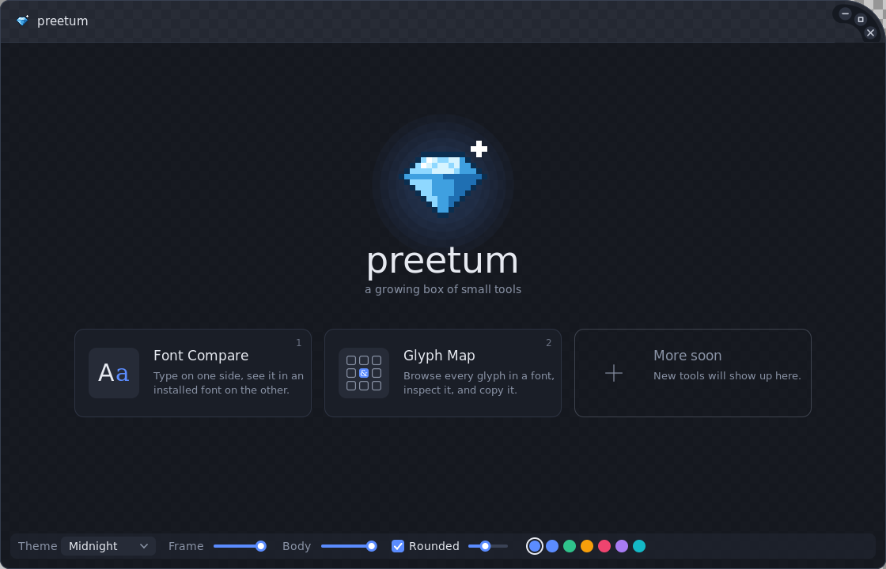
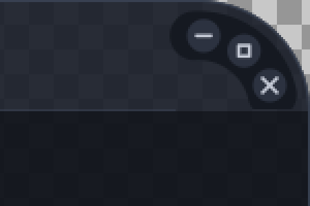
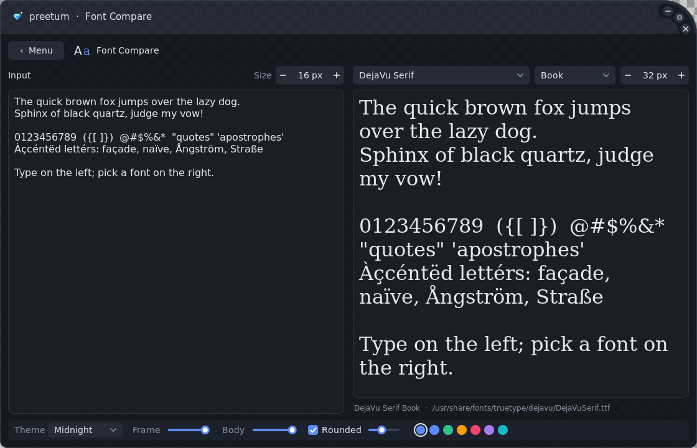
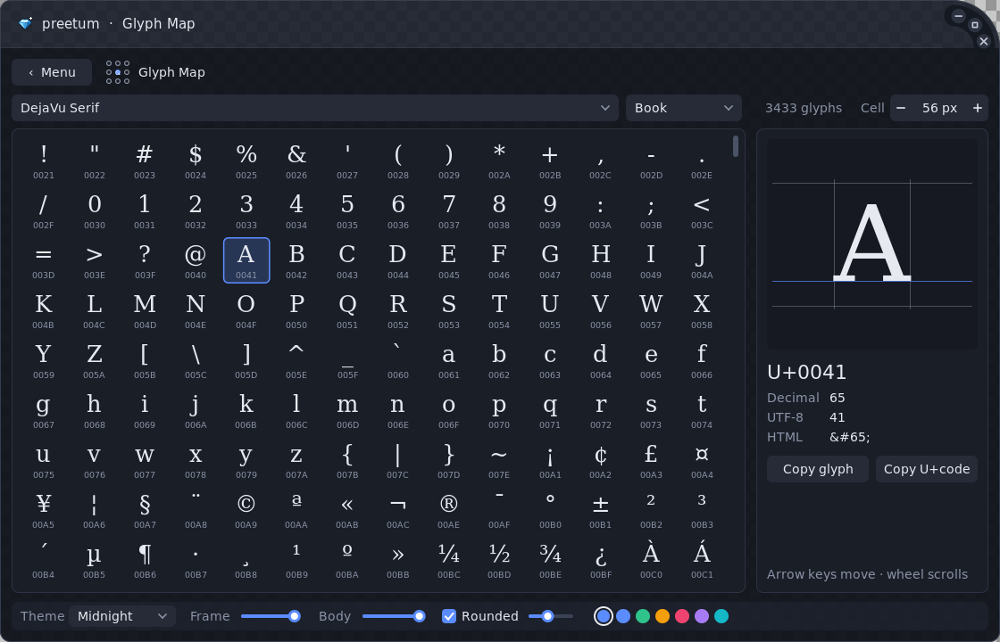

# cgui and preetum

**cgui** is a small cross-platform GUI toolkit in C with a fully custom-drawn window.
**preetum** is the app built on it: a main menu of small tools that will keep growing.

cgui's window features:

- **Custom frame and title bar.** No OS decorations; everything is drawn by cgui.
- **Window buttons on the curve.** Minimize, maximize and close sit along the arc of the
  top-right corner instead of in a horizontal row.
- **Resizable from every edge and corner.** Moves and resizes are handed to the OS or
  window manager, so snapping still works. The resize zone of the big top-right corner
  follows its curve.
- **Adjustable transparency.** The frame (title bar and border) and the window body have
  separate opacity controls. Pixels use real per-pixel alpha, not a whole-window fade.
- **Themes and colours.** Six built-in themes; every colour is a field you can override.
- **Rounded corners option.** Toggle rounded corners and set their radius. Maximized windows
  switch to square corners automatically.



## Documentation

| Document | Contents |
|---|---|
| [docs/ARCHITECTURE.md](docs/ARCHITECTURE.md) | Code structure: layers, how a frame is produced, coordinate spaces, widget state, the platform contract, ownership rules. |
| [docs/DESIGN.md](docs/DESIGN.md) | Why it's built this way, the alternatives that were rejected, and when to revisit them. |
| [docs/PITFALLS.md](docs/PITFALLS.md) | Traps and real bugs from development, the rules that prevent them, and testing recipes. |
| [docs/PREETUM.md](docs/PREETUM.md) | The app's structure, the tool contract, services, and how to add a tool (worked non-font example). |
| [docs/ROADMAP.md](docs/ROADMAP.md) | Platform status, known issues, and what to build next. |
| [CLAUDE.md](CLAUDE.md) | Condensed handoff notes for picking the project back up. |

The checkerboard in the screenshots shows where the frame is translucent. The window buttons:



## preetum

The pixel-art diamond logo appears in the title bar, on the main menu, and as the
taskbar/dock icon. Open a tool from the menu by clicking its card or pressing its number.
To get back to the menu, press **‹ Menu** or Esc.

The bottom bar is on every screen and edits the window's appearance live: theme, frame
opacity, body opacity, rounded corners with radius, and accent colour.

**Font data is loaded only while a font tool is open.**
- On the main menu, only the one UI font is read.
- Opening Font Compare or Glyph Map shows "Loading fonts…" briefly while the installed
  fonts are scanned.
- Leaving frees the font list and every loaded font. The chosen font is remembered by name
  and shared between tools.

### Font Compare



- **Left half:** a multi-line text editor. It has word wrap, selection, a clipboard,
  undo/redo, and word-wise navigation.
- **Right half:** the same text rendered in any font installed on the system. Pick it from
  a dropdown that you can filter by typing, and that previews each font in its own typeface.
  A second dropdown picks the style (Bold, Italic, the named instances of variable fonts, ...).
- **Separate size controls** on each side.

### Glyph Map



- **Grid:** every visible character in the selected font, with its code point under it.
  The cell size is adjustable. Scroll with the wheel or the scrollbar. Select a glyph by
  clicking it or with the arrow keys, Page Up/Down, Home and End.
- **Inspector:** the selected glyph drawn large, with ascender, baseline, descender and
  advance-width guides. It also shows the glyph's U+ code, decimal value, UTF-8 bytes and
  HTML entity.
- **Copy buttons:** copy the glyph itself or its U+ code.

### Adding a tool

A tool is one `apps/preetum/tool_<name>.c` file (a frame function and a menu-card icon) plus
one row in the `tools` table in `main.c`. The row also lists the shared *services* the tool
needs, such as fonts. The menu card, navigation, number-key shortcut and service loading
come for free. [docs/PREETUM.md](docs/PREETUM.md) walks through a complete example that has
nothing to do with fonts (a stopwatch), and explains how to add a new service.

## Building

Dependencies: a C99 compiler and **FreeType**. Linux/BSD also need **Xlib**, plus
Xext for the rounded outline when no compositor is running.

### Linux / BSD (X11)

```sh
sudo apt install build-essential libfreetype-dev libx11-dev libxext-dev   # Debian/Ubuntu
cd cgui
make
./build/preetum
```

Or with CMake: `cmake -S . -B build && cmake --build build`.

### macOS

```sh
brew install freetype pkg-config
cd cgui
make            # or: cmake -S . -B build && cmake --build build
./build/preetum
```

### Windows

With MSYS2/MinGW:

```sh
pacman -S mingw-w64-x86_64-gcc mingw-w64-x86_64-cmake mingw-w64-x86_64-freetype
cmake -S . -B build -G "MinGW Makefiles" && cmake --build build
./build/preetum.exe
```

With Visual Studio, get FreeType from vcpkg (`vcpkg install freetype`) and configure with
`-DCMAKE_TOOLCHAIN_FILE=<vcpkg>/scripts/buildsystems/vcpkg.cmake`.

## Using the library

The API is immediate mode. You describe the UI every frame from a callback, and widgets
report interactions through their return values.

```c
#include "cgui.h"

static float size = 16;
static cg_textbuf text;

static void frame(cg_window *win, cg_rect content, void *user)
{
    cg_rect r = cg_inset(content, 12);
    cg_rect top = cg_cut_top(&r, 30);
    cg_spinbox(win, cg_id_str("size"), cg_cut_right(&top, 110), &size, 8, 72, 1, "%.0f px");
    cg_textedit(win, cg_id_str("editor"), r, &text, NULL, size, 0);
}

int main(void)
{
    cg_window *win = cg_window_create("Hello", 800, 500);
    cg_style *st = cg_window_style(win);
    st->theme = *cg_theme_get(2);   /* "Nord" */
    st->frame_opacity = 0.8f;
    st->corner_radius = 16;
    cg_textbuf_init(&text, "Hello, world");
    cg_run(win, frame, NULL);
    cg_window_destroy(win);
}
```

Widgets: label, button, checkbox, slider, spin box, colour swatch, dropdown (with an optional
filter field and per-row font previews), scrollbar, and the multi-line text editor.

- **Drawing:** anti-aliased rects, rounded rects, circles, lines, text, and nearest-neighbour
  images.
- **Layout:** cut rectangles with `cg_cut_left/right/top/bottom`.
- **Custom widgets:** `cg_interact` (hover/press/click tracking), `cg_wheel`, `cg_set_cursor`
  and `cg_focused` cover what you need.
- **Window icon:** `cg_window_set_icon` sets it from straight-alpha ARGB pixels.
- **Font coverage:** `cg_font_codepoints` lists the characters a font covers.

## How it works

```
include/cgui.h        public API
src/render.c          software rasterizer (premultiplied ARGB, SDF anti-aliasing)
src/font.c            FreeType glyph cache, text measuring and drawing
src/fontdb.c          system font discovery
src/theme.c           built-in themes
src/window.c          main loop, window chrome (title bar, curved buttons, resize zones)
src/ui.c              widget core (hot/active/focus), widgets, dropdown popup
src/textedit.c        the text editor widget
src/platform.h        the interface every backend implements
src/platform_x11.c    Linux/BSD
src/platform_win32.c  Windows
src/platform_cocoa.m  macOS
apps/preetum/         the preetum app (menu, logo, services, tools)
tests/                CTest programs (cmake ... && ctest)
```

See [docs/ARCHITECTURE.md](docs/ARCHITECTURE.md) for the full picture.

- **Rendering.** Every frame is rasterized in software into a premultiplied ARGB buffer.
  Shapes are anti-aliased with signed distance functions. The window outline is a rounded
  rectangle with its own radius per corner. The top-right radius equals the title bar
  height, and the buttons sit on a concentric arc inside it.
- **Transparency per platform.**
  - X11 uses a 32-bit ARGB visual. With no compositor running, X11 can't show translucency,
    so cgui draws the frame opaque and cuts the rounded outline with XShape.
  - Windows uses a layered window (`UpdateLayeredWindow`).
  - macOS uses a non-opaque `NSWindow` whose layer shows the buffer.
- **Moving and resizing.**
  - X11: `_NET_WM_MOVERESIZE`, with a manual pointer-grab fallback when no window manager is
    running.
  - Windows: the native modal loop via `WM_NCLBUTTONDOWN`.
  - macOS: `performWindowDragWithEvent:` for moves and a tracking loop for resizes.
  - A press only turns into a move or resize once the pointer has moved a few pixels, so
    clicks and double-clicks (double-click the title bar to maximize) reach cgui.
- **Fonts.** cgui walks the platform's font directories and reads each face's family and
  style names with FreeType. It uses the same code path on every OS, and every font it lists
  is guaranteed to load. Named instances of variable fonts are listed as separate styles.
  - **Scanning is on demand.** It only happens when `cg_fontdb_scan()` is called, and
    `cg_fontdb_release()` drops the list again.
  - **Opening a window doesn't scan.** The UI font is found at a well-known path per OS.
- **Event loop.** It sleeps until input arrives. The only timer is the caret blink, so an
  idle window uses no CPU.
- **HiDPI.** All API coordinates are logical pixels. The DPI scale comes from `Xft.dpi` on
  X11, `GetDpiForWindow` on Windows and `backingScaleFactor` on macOS. `CGUI_SCALE=1.5`
  overrides it.

Environment variables:

| Variable | Effect |
|---|---|
| `CGUI_SCALE` | Force a UI scale factor. |
| `CGUI_FONT` | Path of the font file to use for the UI. |
| `CGUI_SCREENSHOT=out.ppm` | Render a couple of frames, write the image composited over a checkerboard, and exit. |
| `PREETUM_TOOL=n` | Start preetum in tool `n` (1-based) instead of the menu. |

## Status and limitations

The live list is [docs/ROADMAP.md](docs/ROADMAP.md). In short:

- **X11:** tested under Xvfb with no window manager, and with Openbox plus the xcompmgr
  compositor. That covered typing, selection, clipboard, undo/redo, dropdowns, theme and
  opacity changes, move and resize (edges, corners and the curved top-right corner),
  maximize and restore (button and double-click), minimize and close.
- **Windows:** cross-compiled with MinGW and run under Wine. Rendering, the window icon, typing, clipboard,
  native move and resize, maximize and close work there. Under Wine the maximized size snaps
  back to the restored size right away. That comes from Wine's X11 driver (it sends the
  resize itself), and it has not yet been checked on real Windows.
- **macOS:** the backend is written, but it has not been compiled or run: no macOS SDK was
  available during development. Expect it to need small fixes.
- **Text shaping:** kerning comes from the `kern` table only, with no HarfBuzz. Complex
  scripts and right-to-left text will not be shaped, and there is no fallback font for
  missing glyphs.
- **Text input:** plain keyboard input. Dead keys work through XIM on X11 and `WM_CHAR` on
  Windows. There is no IME composition window.
- **Wayland:** runs through XWayland.
